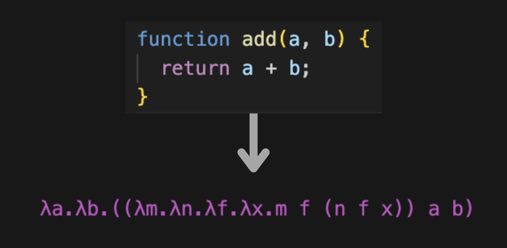
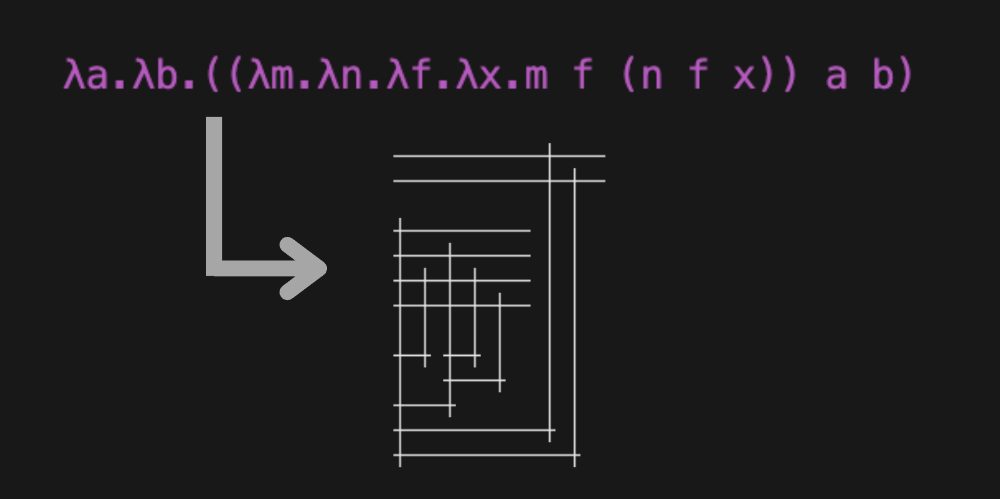

# Welcome to jambda-calc

#### An npm package for transpiling JS/TS into λ calculus, and visualizing expressions with [Tromp Diagrams](https://tromp.github.io/cl/diagrams.html).

Lambda calculus is one of the most simple Turing-complete languages, meaning that theoretically any valid programmatic function can be transpiled from it's native language, into a lambda expression.

In lambda calculus, everything is considered a function and creates the computation

Turing complete, simple language. Everything is a fn. Link to vid
Vision is to process entire js projects into diagrams

---

### Transpiler Functionality:

The transpiler (for converting JS/TS code into lambda calc), has handling for input files containing:

- Arithmetic (+, -, /, \*)
- Common JS operators (!=, ==, ===)
- Number/boolean literals (-100 to 100, true/false)
- Conditionals (if else, switches)
- Nested functions (defined in the same input file)
- Basic member functions like .filter() and .map()

Not yet implemented:

- String operations
- Imported functions/modules from other files/dependencies
- Other member functions (Math.cos(), Math.log()) - Get abstracted as ((λobj.λprop.obj prop) ${func} (λx.x))

### Visualizer Functionality

The visualizer converts [formal λ calculus](https://opendsa.cs.vt.edu/ODSA/Books/PL/html/Syntax.html) into Tromp Diagrams.

- Lambda abstractions (functions) are represented as horizontal lines across the top.
- Variables (params) cross abstraction lines vertically.
- Applications connect the bottom-left corners of terms being applied.

---

## Installation

`pnpm install jambda-calc`

_Note: Using pnpm for these examples, but npm works exactly the same._

## CLI Usage

After installing in your project directory, you can use `pnpm jambda-calc` with various flags to run transpilation or visualization from the command line.

##### Helper Commands

`pnpm jambda-calc examples` - Run three example functions through transpilation and visualization.

`pnpm jambda-calc --help` - Display the options for flags.

##### Basic commands

- `pnpm jambda-calc -i path/to/input-file.js`: Runs transpilation and visualization on an input file (required). Prints results to console.
- `pnpm jambda-calc -i path/to/input-file.js -t`: Only run transpilation.
- `pnpm jambda-calc -i path/to/lambda-expression.txt -v`: Only run visualization (input file containing lambda expression to visualize).

##### Flags

- `-i, --input`: Input file to run transpilation or visualization on. (Required)
- `-o, --output`: Output dir to save output files: lambda expression (.txt) and/or tromp diagram (.png). Prints in console if not specified.
- `-t, --transpile` and `-v, --visualize`: Choose which task(s) to preform, if neither is specified, it runs both. If only visualize is set, it will expect a .txt input file containing an expression.
- `-f, --format`: Specify the file extension of the tromp diagram being saved: `png` or `svg`.
